# 关于Mixin上出现的诈骗

## 有人被骗

光是我听说的就有好几个人被骗了，被骗金额加起来可能有大几百万

被诈骗以后，钱就追不回来了
被诈骗以后，钱就追不回来了
被诈骗以后，钱就追不回来了

如果是在已经知道对方是骗子的前提下，看被骗人发的和骗子的聊天截图，会有这样的感受：这也能被骗？明明一看就是骗子啊

当你作为旁观者的时候，很可能一眼就能看出对方是骗子，当你作为当事人的时候，往往是分不清的。

短视频平台上有很多类似的视频，被骗人即便到了派出所，即便警察已经告知被骗人是被诈骗了，然后被骗人依然不相信自己被骗，埋怨警察耽误自己的事了，还要继续坚持给对方转钱。

在Mixin上防止被骗，其实很简单，只需要做到以下几步就可以了。

- 设置不接收陌生人消息
- 删除已有的联系人
- 删除已有的“群聊”

## 设置不接收陌生人消息

骗子几乎都是陌生人，因为骗子是第一时间加你好友，第一时间给你发消息的。所以Mixin上自己已有的联系人，是骗子的几率小了些。

在Mixin上，如果对方不是你的联系人，它给你发消息的话，默认你是能接收到消息的。

在Mixin上可以设置不接收陌生人的消息，这样骗子在Mixin上就无法私聊我们了，从根上就避免了和骗子接触。

具体操作如下图：

在Mixin首页，点击右上角的头像

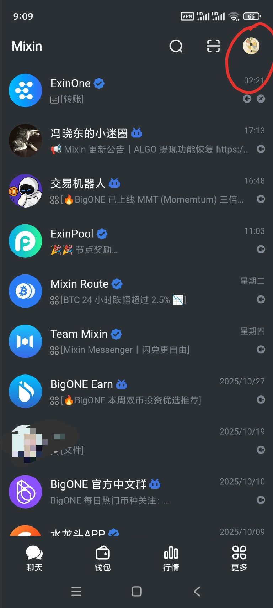

然后点击右上角的齿轮图标

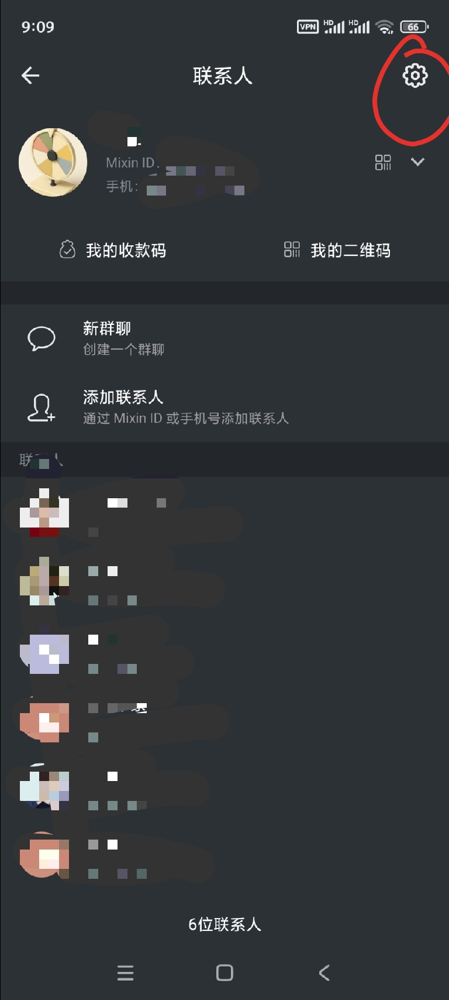

然后点击“账号”

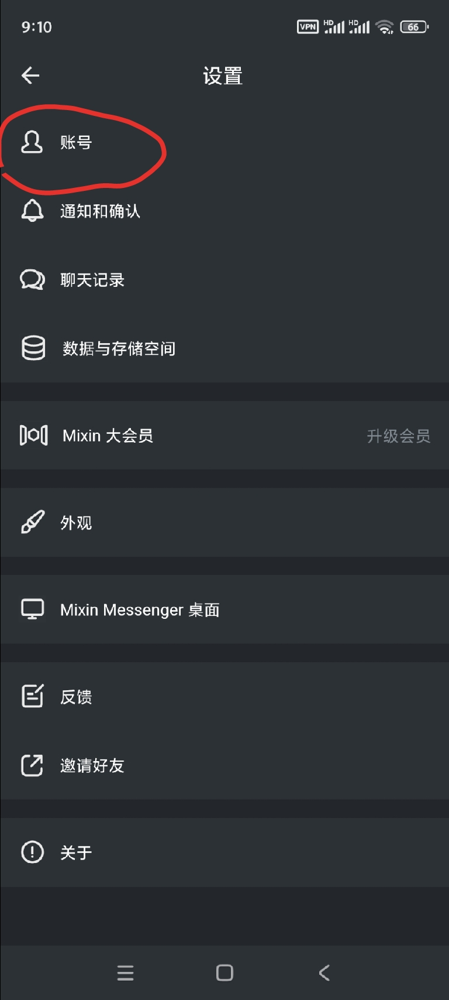

然后点击“隐私”

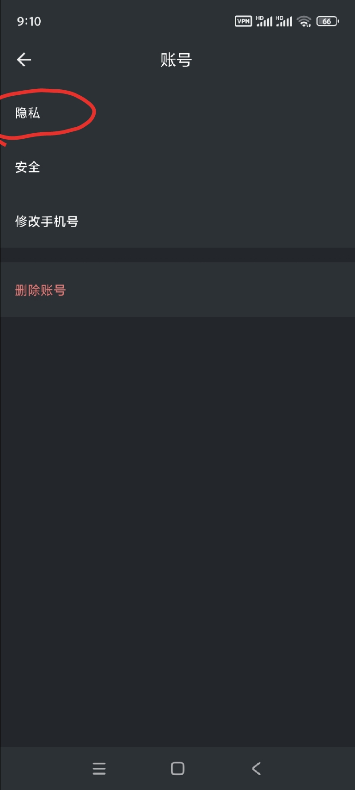

Mixin上默认的是：
“任何人”可以给我发消息
“任何人”可以邀请我加入群组

我们不要默认的设置，要改成下图的设置。

> 这个默认的设置真的很狗血，如果默认的设置是下图的话，就不会有那么多人被骗了——骗子压根无法和我们私聊
>
> 我跟Mixin客服反馈过，不知道他们会不会改这个默认设置。
>
> 在这里不得不吐槽一句Mixin的用户体验太差了。在Mixin首页最底部会出现一个陌生人，这个bug反馈那么久了竟然都还没改。反观我在得到上的体验，简直是一个天上一个地下。

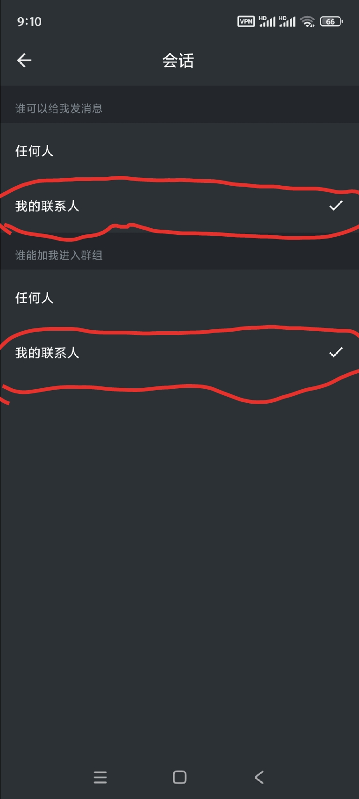

## 删除已有的联系人

Mixin的用途是：购买数字资产

Mixin确实也是一个聊天工具，同时我相信绝大多数人使用Mixin的主要目的都不是为了聊天。在聊天方面，Mixin可有可无——即便隐私安全相当重要，但是在乎的人就是少数

> 要不是因为Mixin可以购买数字资产，要不是因为笑来老师在用Mixin，如果Mixin仅仅是聊天工具的话，估计早就倒闭了

既然我们用Mixin是进行购买投资标的用的。所以，把Mixin上已有的联系人几乎全部删掉，并不会影响到自己的“投资”。最大的影响是：减少了自己被诈骗的风险。

> 家人和好朋友的Mixin联系人别误删了
>
> 教程是写给小白的。资深的Mixin用户，很可能联系人有很多，而且有很多都是要留下的。

删除联系人的操作也很简单，就是需要点击屏幕的次数有点多。

具体步骤如下：

如下图，找到联系人页面，点击任何一个联系人

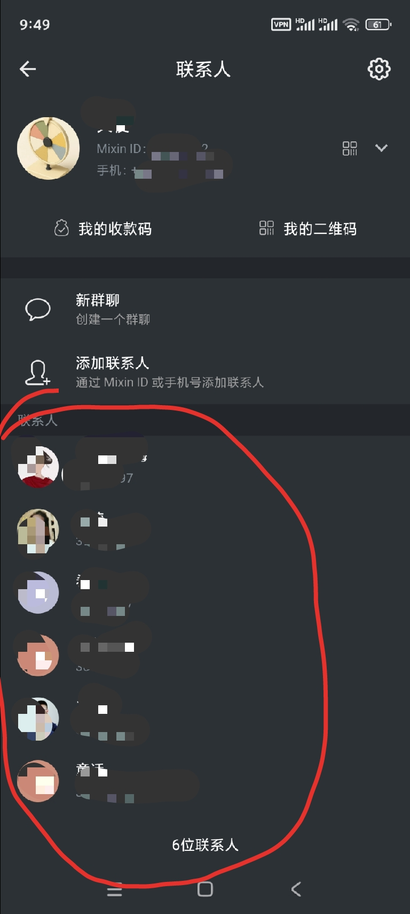

然后点击下图右上角的头像

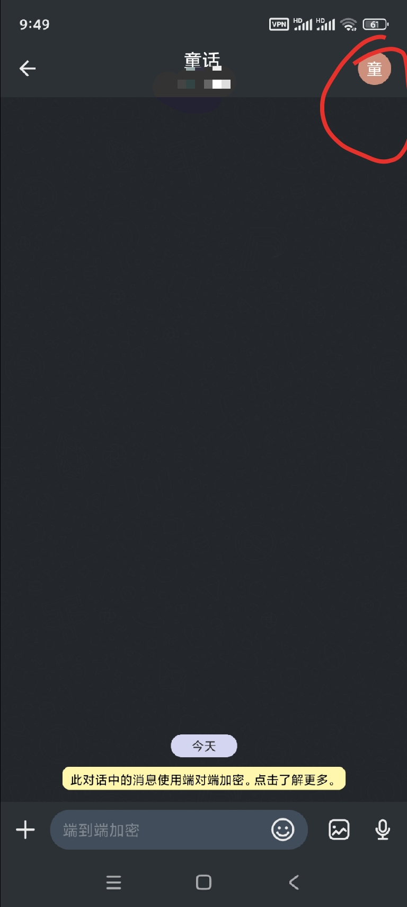

然后点击下图红圈中的图标

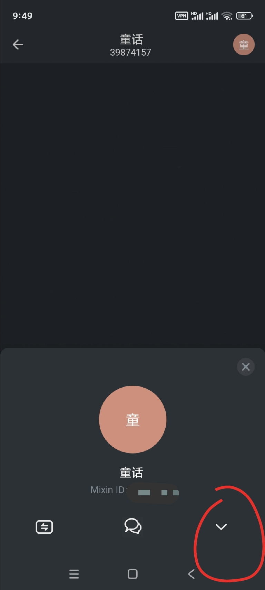

然后在新界面里往下拉，选择“删除联系人”

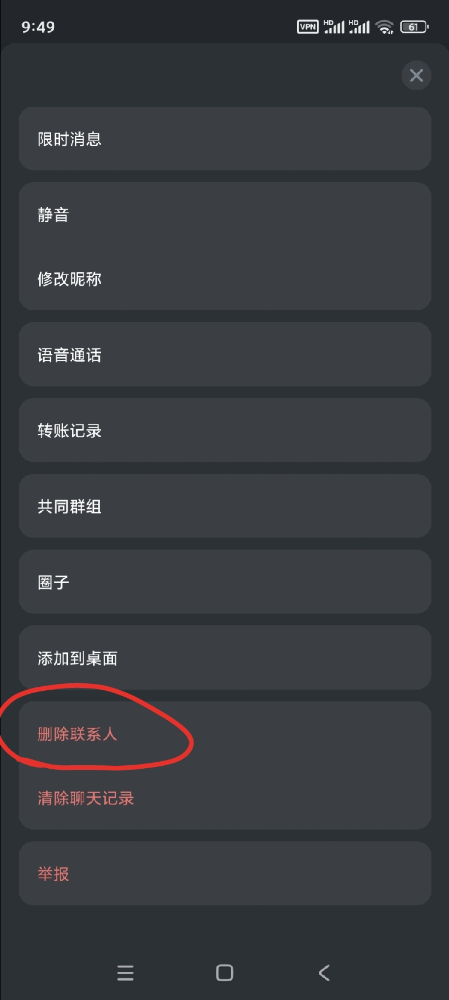

不是必须的联系人，直接删掉。

## 删除已有的“群聊”

Mixin上群聊分为两种。一种是有1024人数上限的群聊；另一种其实是机器人模拟成群聊的样子，人数无上限，有ID。

1024人数上限的群聊，很好退出。类似于微信退出群聊的操作步骤。我没有在这样的群聊里，无法提供具体的退出步骤。

机器人群聊的退出是不那么方便的，因为它不是真正的群聊，删除机器人之后，还是会接收到机器人群聊的消息。

退出机器人群聊一共分为3步：

1. 删除机器人群聊
2. 屏蔽机器人群聊
3. 取消对机器人的授权

下面的操作步骤是我随便找个群聊做例子

在Mixin首页点击要退出的机器人或机器人群聊

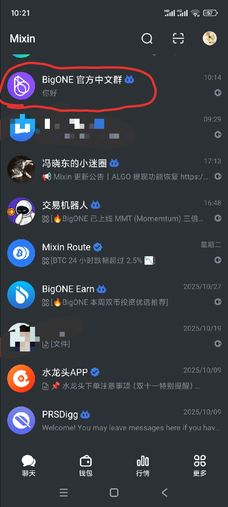

点击右上角头像

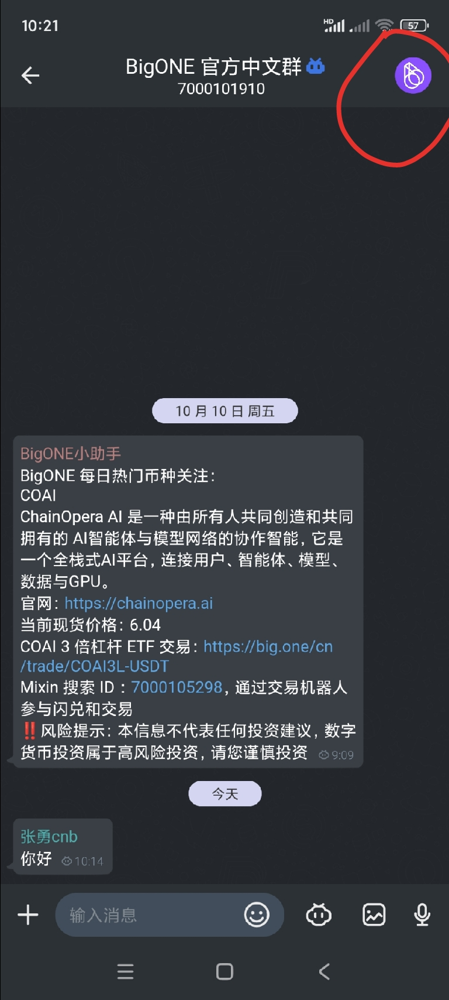

> 有的机器人群聊还是一个真正的机器人，点击机器人图标后，会得到新的可操作页面

点击右下角图标

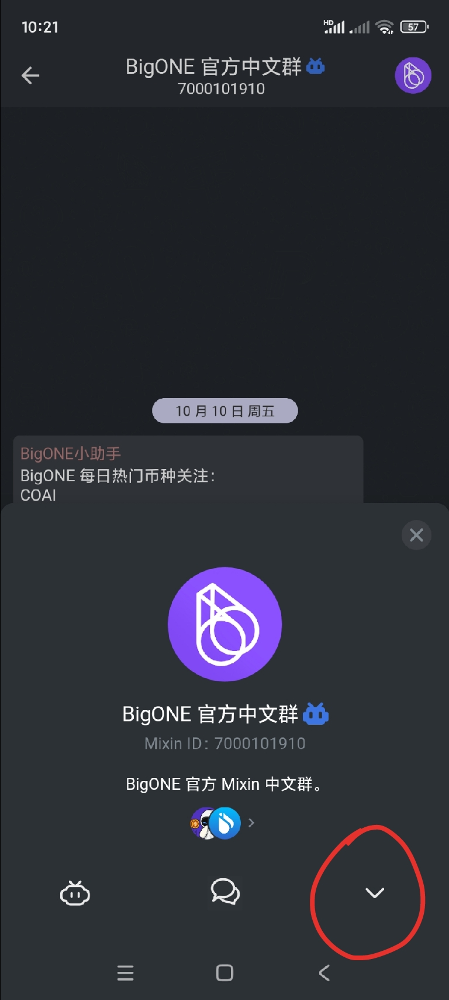

拉到最底部，点击“删除机器人”

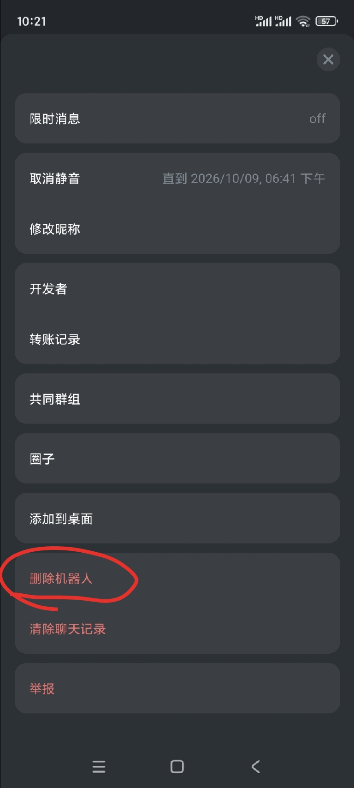

然后“删除机器人”的位置会变成“屏蔽联系人”，点击“屏蔽联系人”，否则还会收到这个机器人群聊的消息

如果之前点击过这个机器人群聊页面中的机器人图标（如下图），那么还要对这个机器人取消授权，这样才能段落和这个机器人的联系。

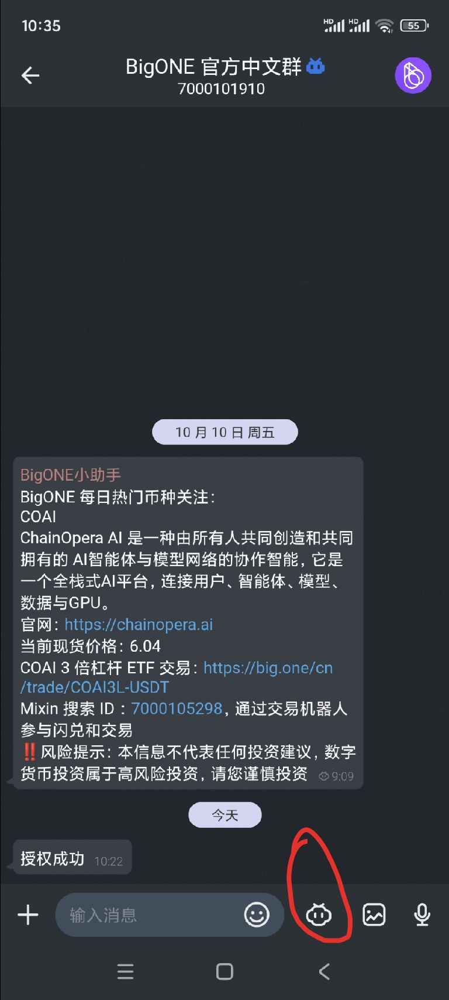

取消对机器人授权，具体操作步骤如下：

正如文章最开始的教程步骤一样，找到账号这个页面，点击“安全”

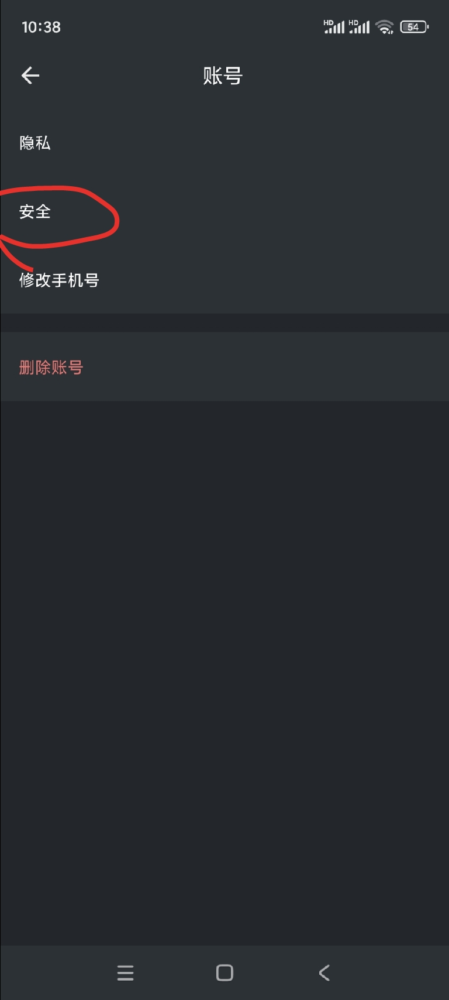

点击“授权”

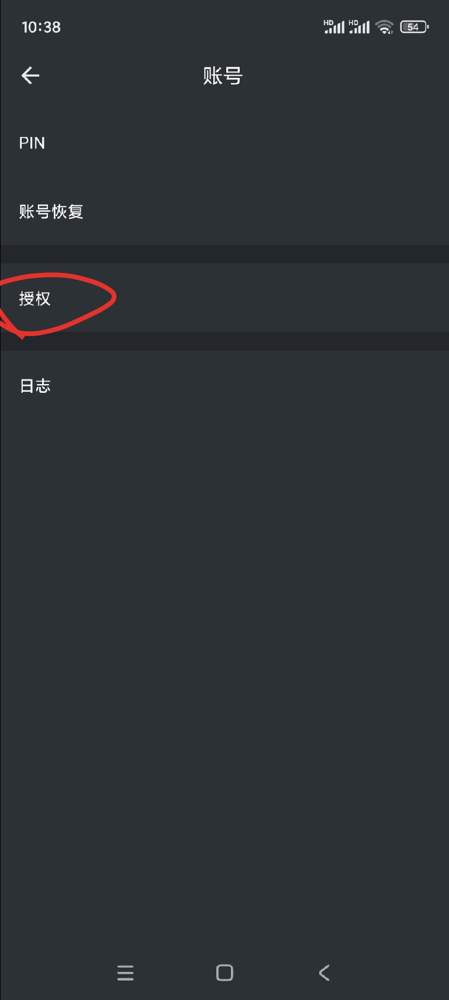

点击要取消授权的机器人

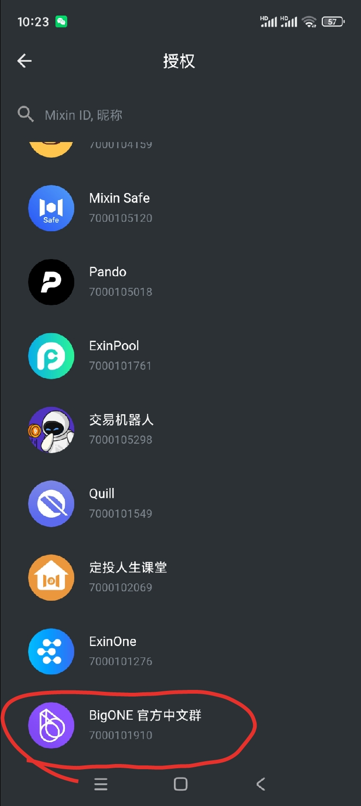

点击“取消授权”

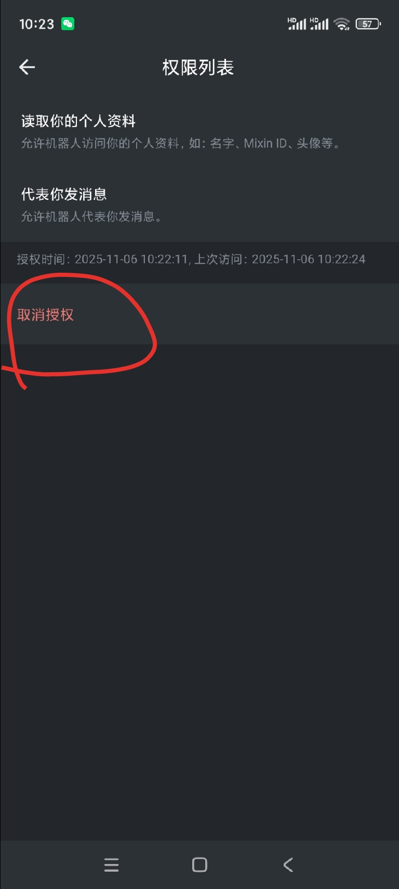

